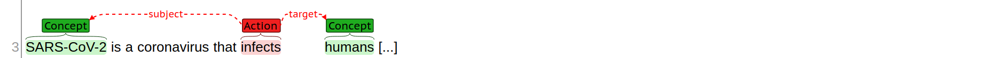
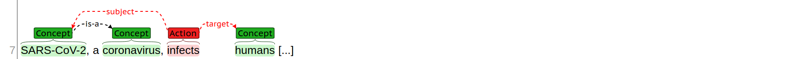
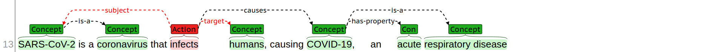
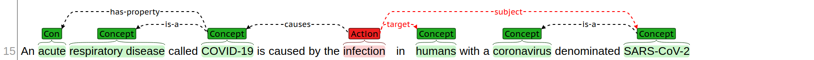

# Welcome to the Annotation Guide for the CORD-19-ANN Corpus

The CORD-19-ANN corpus is a collection of sentences extracted from research papers related to the novel coronavirus disease (COVID-19) detected in December 2019 in the province of Wuhan, China, which later expanded to nearly all the world. In reponse to the COVID-19 pandemic, an international alliance of doctors, scientists, researchers, and volunteers all over the world is leading an effort to understand, contain, and develop treatments for the SARS-CoV-2, the virus that causes the disease. As part of this effort, several academic publishers have made freely available thousands of research papers related to this and other coronavirus diseases.

This collection is extremely relevant since published research might contain clues to fight the epidemic hidden among thousands of different experimental reports, tables and figures, dicussion sections, etc. Manually digging through thousands of papers finding for these clues is unfeasible, so we must turn to artificial intelligence. However, it is very hard for algorithms to understand human language, even scientific, objective, language. We can ease this problem by providing the algorithms with a small set of sentences where humans manually annotate what's relevant and make explicit the semantic relations between different elements in the text.

Your mission, should you choose to accept it, is to manually annotate sentences extracted from these papers, a process in which you will select the most relevant elements mentioned and determine how they are semantically connected. This guide will show you how. As an example, let's take this sentence, shown here in its fully annotated glory, and break it piece by piece.

The most important elements to annotate are concepts and actions. A concept can be either a single word ("humans") or multiple words ("respiratory disease") that represent a well-defined concept in this domain, e.g., a body part, a scientific term, a disease or a class of diseases, a medical tool, etc. Things like determinants, articles, etc., that are only important for grammatical reasons but don't carry a semantic meaning on their own are not considered concepts. 

An action, on the other hand, is a word (or multiple words) that represents a process, and event, or some sort of transformation that some entities (concepts) can perform on some other entities. The concepts that perform an action are called "subjects", and the one that receive the direct or indirect consequences of the action are called "targets". An action often appears in textual form as a verb, like in this example, but it can also appear as a noun, in examples we will see later on.

Often the best way to approach a sentence like the one before is to try and detect the main statement in the sentence. That is often an action with the corresponding subjects and targets (any of which can be ommited). For example, in this case, the main statement is arguably "SARS-CoV-2 [...] infects [...] humans", and so we annotate it like this:

Both "SARS-CoV-2" and "humans" are concepts that are relevant in the medical domain, that is, not filler words, determinants, etc., but actual medical entities important for transmiting the meaning of the sentence. Likewise, "infects" is an action, not just because it is a verb, but rather for the fact that "to infect" is also an important concept in the medical domain, it expresses a process that can happen, and can be clearly associated with an entity that provokes it and an entity that receives the effect.

The remaining part of the sentence is a subordinate idea, but before going there, we can finish with the main fragment. The other relevant piece of knowledge that is being stated is the fact that "SARS-CoV-2 is a coronavirus". Now this is the case of a pattern that is so common and so important, that instead of trying to annotated "is" as an action (which would be wrong) we instead use a specific semantic relation to represent that:

Using semantic relations like this is important, because we can annotate the same knowledge even if its stated slightly differently. For example, if instead of saying explictly "... is a coronavirus" we had something like the following, we would still annotate the "is-a" because it is implicitely implied by the phrase between commas.

This is a very important point to make early on. We are interested in extracting the semantic knowledge being expressed in each sentence, irrespective of the syntax. So there can be many different ways of expressing the same idea, changing the order of words in a sentence, adding or removing some unnecessary determinants, and all of those should ideally lead to the same annotation. A good rule of thumb for checking that your current annotation is semantic rather than just syntactic, is to think of different ways of expressing the same idea, and what we would annotate in that case.

Moving on the next part of the sentence, we also have a very similar pattern between "COVID-19" and "respiratory disease".

Notice that in this case there is no explicit "is a" but we can still infer it from the text. The next interesting piece of knowledge is that this respiratory disease is "acute", which is another relevant concept in this domain, because it has a very well-defined meaning. Now, in this case, the sentence reads "[...] COVID-19, an acute respiratory disease", but what is actually saying is simply that COVID-19 is a disease, and that it is acute. So even though, syntactically, "acute" is modifying "respiratory disease", from the semantic point of view, it is actually modifying the concept of COVID-19. Hence, we can annotate it like this:

To finish this sentence, we need to link the first part with the second part. Syntactically, the link is established by the word "causing". However, this is another case in which such a concept is so important that we have a custom relation for that, named "causes". We use this relation whenever we find in a sentence a direct causal statement, e.g, A causes B, A provokes B, B is caused by A, and similar. In this specific sentence, what causes the COVID-19 disease (as stated by the sentence) is not the virus itself, but the action of infecting the body. Hence, the annotation goes like this:

Take a time to look at the annotations, forget about the actual words that appear in the sentence, specially forget about the articles, connectors, the distinction between singular and plural, the time and gender of words, etc., and try to read it from the semantic point of view. There is something called "SARS-CoV-2", that is a member of a group of things called "coronavirus", it performs the action "infect" on things that are called "human", and this action triggers the appearance of something called "COVID-19", which itself is a member of group of things called "respiratory disease", and has the property of being "acute". If that reading sounds to you as semantically equivalent to what the sentence says, then it is correctly annotated.

As an example, here is a completely different rewrite of the same sentence that is, nevertheless, semantically identical, and thus annotated in the same way:

